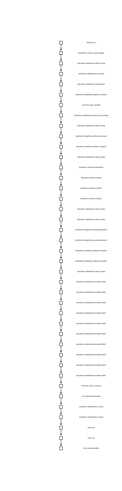

# ml_pipeline

## CLI: interface for building and executing pipeline.
Takes a yaml file as input.
```yaml
- stages:
    - extract.postgres:
        parameter:
          sql: "01extract.sql"
          conn:
            parameter:
              host: !Var dbhost
              port: !Var dbport
              dbname: !Var dbname
              user: !Var dbuser
              password: !Password dbuser
        input: null
        output: raw
```

In the example yaml above, you define each stages of the pipeline with three must have keys, 
* parameter
* input
* output

This creates a node in the DAG, that is executable. yaml standard has been exxtended to make yaml parameterized. Either external parameters can be passed through an additional json file or some parameters like Date, and UUID can be generated.

```yaml
run_id: !UUID
current_date: !Date today
```

would resolve at runtime as:

```python
[('run_id', '9de49f84-f448-4f52-bad9-be41804be443'),
('current_date', '2021-10-17 07:32:14.249768')]
```

!Password tag uses keyring to resolve pasword given a user name.

## A complete pipeline
